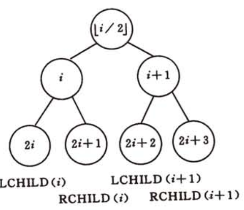

# 算法

[TOC]

- NP-complete问题

no polynomial complete, 不可以在多项式时间内求解。

一个NPC问题的例子是[子集合加总问题](https://zh.wikipedia.org/wiki/子集合加總問題)，题目为:

​	给予一个有限数量的整数集合，找出任何一个此集合的非空子集且此子集内整数和为零。

​	即: S是一个包括若干整数的集合，找出任一一个$S^{'} \subset S$且$\sum_{x \in S^{`}}s=0$

这个问题的答案非常容易验证，但当前没有任何一个够快的方法可以在合理的时间内（意即多项式时间）找到答案。只能一个个将它的子集取出来一一测试，它的时间复杂度是Ο(2n)，n是此集合的元素数量。

## 算法基础

### 插入排序

<span style="color:red">最坏运行时间: $\theta (n^2)$</span>

**类似排序扑克牌**

**循环不变式:** 

- 初始化: 循环第一次迭代前为真
- 保存：循环每次迭代之前为真，迭代之后为真
- 终止

```c++
#include <iostream>
#include <vector>
using namespace std;

int main(){
    int arr[6] = {5, 2, 4, 6, 1, 3};
    vector<int> vec(6);
    for(int i = 0; i < vec.size(); i++){
        vec[i] = arr[i];
    }

    int key, j;
    for(int i = 1; i < vec.size(); i++){
        key = vec[i];
        j = i -1;
        while (j >= 0 && key < vec[j]){
            vec[j+1] = vec[j];
            j--;
        }
        vec[j+1] = key;
    }

    for(int i = 0; i < vec.size(); i++){
        cout << vec[i] << " ";
    }
}
```

## 分析算法

- 时间复杂度

### 设计算法

- 增量法

### 分治法

把原问题分解为几个规模较小但类似于原问题的子问题。

- 分解
- 解决
- 合并

#### 归并排序

<span style="color:red">最坏运行时间:$\theta (nlgn)$</span>

```c++
#include <iostream>
#include <vector>
using namespace std;

void merge(vector<int>& vec, int i, int p, int j){
    vector<int> L(vec.begin() + i, vec.begin() + p + 1);
    vector<int> R(vec.begin() + p + 1, vec.begin() + j + 1);
    int x = 0, y = 0, m;
    for(m = i; m <= j; m++){
        if(L[x] < R[y]){
            if(x < L.size()) {
                vec[m] = L[x];
                x++;
            } else{
                break;
            }
        } else {
            if (y < R.size()) {
                vec[m] = R[y];
                y++;

            } else{
                break;
            }
        }
    }
    while (m <= j && x < L.size()){
        vec[m] = L[x];
        m++, x++;
    }
    while (m <= j && y < R.size()){
        vec[m] = R[y];
        m++, y++;
    }
}

void sort(vector<int>& vec, int i, int j){
    if(j - i > 0){
        int p = (i + j)/2;
        sort(vec, i, p);
        sort(vec, p + 1, j);
        merge(vec, i, p, j);
    } else{
        return;
    }
}

int main(){
    int arr[8] = {23 ,11 ,5, 2, 4, 6, 1, 3};
    vector<int> vec(8);
    for(int i = 0; i < vec.size(); i++){
        vec[i] = arr[i];
    }

    sort(vec, 0, vec.size() - 1);
    for(int i = 0; i < vec.size(); i++){
        cout << vec[i] << " ";
    }

}
```

## 函数的增长

渐近符号

- Θ(g(n))Θ(g(n)) 用来表示一类函数 f(n)f(n) ，存在 c1、c2c1、c2 和 n0n0，使得对于所有 n≥n0n≥n0，都有 0≤c1g(n)≤f(n)≤c2g(n)0≤c1g(n)≤f(n)≤c2g(n)。

- O(g(n))O(g(n)) 表示一类函数 f(n)f(n)，存在 cc 和 n0n0，使得对于所有 n≥n0n≥n0，都有 0≤f(n)≤cg(n)0≤f(n)≤cg(n)。一般读作“大 O”或者“Big-Oh”。
- Ω(g(n))Ω(g(n)) 表示一类函数 f(n)f(n)，存在 cc 和 n0n0，使得对于所有 n≥n0n≥n0，都有 0≥cg(n)≥f(n)0≥cg(n)≥f(n)

- $n = O(n^2)$ 表示$n \in O(n)$
- $T(n) = 2T(n/2) + \theta (n)$ $\theta (n)$表示匿名函数

## 分治策略

递归式求解<span style="color:red">$\theta$</span>或<span style="color:red">$O$</span>的方法

- **代入法** 预测一个界限，然后用数学归纳法证明
- **递归树法** 化成棵树求解
- **主方法** 使用递归公式。

- strassen

strassen算法的关键不在于是乘法还是加法，而是在于算法内部递归调用的次数。

其实算法导论上说的很清楚了，用分治的方法也可以普通方法实现，时间复杂度和循环一样都是 O(n^3)。

strassen算法的关键在于内部递归调用的次数减少了1（从普通的8次变为特殊的7次）。这里的一个结论就是递归算法中递归调用次数少，时间复杂度底。这很容易理解，在算法导论中用了“茂盛”度来描述这一时间复杂度在递归算法中的变化。

所以strassen算法的关键在于，递归调用的次数怎么从8次减少一次的。

反推理解一下，这说明8次递归调用中有一次是冗余的，即第8次递归乘法的结果信息已经包含在了前7次的结果里，前7次的计算结果通过线性组合就能得到第8个递归的结果了。而该线性组合的时间复杂度低于该算法本身（即一次递归调用）的时间复杂度。

做一个结论。但凡是能够优化时间复杂度的算法，高复杂度的算法中必然是有一些计算是冗余的，如能用更少的计算代替冗余，就能提高效率。

（因为算法递归的刚好是乘法，所以此处看起来似乎是重点放在了乘法上）

\-------------

至于为什么传统矩阵相乘算法中有冗余计算，也尝试分析一下：

冗余的根本原因应该在于基本的乘法分配律a*(b+c)=a*b+a*c。同样的计算结果，前一种（等号前）方法计算需要2次基本运算，而后一种（等号后）方法需要3次。（假设乘法运算和加法运算是同等开销的基本运算）。

而一般的矩阵乘法算法中是大量的单步乘法运算后求和，即采用的是上述等号右边的计算式。如果能有一种方法，将乘法运算中的相同因子提到前边来，运用上述乘法分配律转换计算形式，那么就能提高计算效率。

这应该就是strassen算法的本质。

看strassen算法的过程，就是先将一部分子矩阵进行加（减）运算，再进行乘法运算。其实就是构造了上述分配律的左式。

## 数据结构

- 队列 `#include <queue>`

`front()` `empty()` `push`() `pop()` `size()` 

- 栈 `#include <stack>`

`front()` `empty()` `push`() `pop()` `size()` 


---

对比测试： 找一个正确的程序对比自己的程序测试

随机数法:  

```
#include <stdlib.h>
#include <time.h>

srand(time(NULL));
rand();//Returns a pseudo-random integral number in the range between 0 and RAND_MAX.
random();//This library allows to produce random numbers using combinations of generators and distributions:
```

### 二叉树

**满二叉树**: 深度为k且有$2^k - 1$个结点的二叉树

**完全二叉树**: 深度为k的，有n个结点的二叉树，当且仅当启每一个结点都与深度为k的满二棵树从编号1到n一一对应时，称之为完全二叉树.

---

- 在二叉树的第i层上至多有$2^{i-1}$个节点($i \geq 1$)
- 深度为k的二叉树至多有$2^k -1$个结点
- 对于任何一颗二叉树T,如果其终端结点数为$n_0$，度为2的结点数为$n_2$,则$n_0 = n_2 + 1$
- 具有n个结点的完全二叉树深度为$\lfloor log_2n \rfloor + 1 $
- 完全二叉树（结点编号从1开始）
  - 如果i=1，则节点i是二叉树的根节点，无双亲；如果i>1，则其双亲节点是$\lfloor i/2\rfloor$
  - 如果2i>n，则节点i无左孩子；否则其左孩子就是2i
  - 如果2i+1>n，则节点i无有右孩子；否则其右孩子就是2i+1



---

```
vector<type>(n);

struct node{
	type data;
	node * leftChild;
    node * rightChild;
}
```

---


```c++
  node * root = new node;
    root->data = 'A';
    root->leftChild = new node;
    root->leftChild->data = 'B';
    root->leftChild->leftChild = NULL;
    root->leftChild->rightChild = new node;
    root->leftChild->rightChild->data = 'C';
    root->leftChild->rightChild->leftChild = new node;
    root->leftChild->rightChild->leftChild->data = 'D';
    root->leftChild->rightChild->leftChild->rightChild = NULL;
    root->leftChild->rightChild->leftChild->leftChild = NULL;
    root->leftChild->rightChild->rightChild = NULL;
    root->rightChild = new node;
    root->rightChild->data = 'E';
    root->rightChild->leftChild = NULL;
    root->rightChild->rightChild = new node;
    root->rightChild->rightChild->data = 'F';
    root->rightChild->rightChild->leftChild = new node;
    root->rightChild->rightChild->rightChild = NULL;
    root->rightChild->rightChild->leftChild->data = 'G';
    root->rightChild->rightChild->leftChild->leftChild = new node;
    root->rightChild->rightChild->leftChild->leftChild->data = 'H';
    root->rightChild->rightChild->leftChild->leftChild->leftChild = NULL;
    root->rightChild->rightChild->leftChild->leftChild->rightChild = NULL;
    root->rightChild->rightChild->leftChild->rightChild = new node;
    root->rightChild->rightChild->leftChild->rightChild->data = 'K';
    root->rightChild->rightChild->leftChild->rightChild->leftChild = NULL;
    root->rightChild->rightChild->leftChild->rightChild->rightChild = NULL;
```


- 先序

```c++
void preOrderTravel(node * root){
    stack<node *> treestack; // build stack
    node * p = root;// p pointer root
    while (p != NULL || !treestack.empty()){//
        if(p != NULL){
            cout << p->data;
            treestack.push(p);
            p = p->leftChild;
        } else{
            p = treestack.top();
            treestack.pop();
            p = p->rightChild;
        }
    }

}
```
- 中序

```c++
void inOrderTravel(node *root){
    stack<node *> treeStack;
    node * p = root;
    while (p != NULL || !treeStack.empty()){
        if(p != NULL){
            treeStack.push(p);
            p = p->leftChild;
        } else{
            p = treeStack.top();
            treeStack.pop();
            cout << p->data;
            p = p->rightChild;

        }
    }

}
```
- 后序

```c++
void postOrderTravel(node * root){
    if(root == NULL)return;
    stack<node *> treestack;
    node * p, *plast;
    p = root;
    plast = NULL;
    while (p){
        treestack.push(p);
        p  = p->leftChild;
    }

    while (!treestack.empty()){
        p = treestack.top();
        treestack.pop();

        if(p->rightChild == NULL || p->rightChild == plast){
            cout << p->data;
            plast = p;
        } else{
            treestack.push(p);
            p = p->rightChild;
            while (p){
                treestack.push(p);
                p = p->leftChild;
            }
        }
    }
}//每次到最左，记录last访问
```


- 层次遍历

```c++
void layerTravel(node * root){
    if(root == NULL){
        return;
    }
    queue<node *> myqueue;
    myqueue.push(root);
    node * p;
    while (!myqueue.empty()){
        p = myqueue.front();
        myqueue.pop();
        cout << p->data;
        if(p->leftChild != NULL){
            myqueue.push(p->leftChild);
        }
        if(p->rightChild != NULL){
            myqueue.push(p->rightChild);
        }
    }
}
```

----

### 图

- 有向图
- 无向图
- 完全图
- 稀疏图
- 稠密图
- 子图

----

- 邻接点

- 相关联
- 度
- 入度
- 出度

----

- 回路/环

- 简单路径
- 连通
- 连通图
- 连通分量
- 强连通图
- 强连通分量
- 连通图生成树

----

#### 数组表示法

```c++
class MGrapg{
	VertexType vexs[MAX_VERTEX_NYM];
	AdjMatrix arcs;//邻接矩阵
	int vexnum, arcnum;
	GraphKind kind;
}
```


#### 邻接表

```c++
struct ArcNode{
	int adjvex;//该弧指向顶点的位置
	struct ArcNode *nextarc;//只写下一条弧的指针
	InfoType *info;//该弧有关的信息
};

struct Vnode{
	VertexType data;//顶点信息
	ArcNode * firstarc;
};

struct ALGraph{
	AdjList vertices;
	int vexnum, arcnum;
	int kind;
}
```


#### 图的遍历

##### DFS

Depth First Search

 首先访问一个相邻顶点，并继续访问该相邻顶点的一个相邻顶点，重复执行直到当前正在被访问的顶点不存在未访问状态的相邻顶点，则回退到上一个顶点继续按照该深度优先方式访问。因为存在回溯行为，所以需要借助栈结构保存顶点，或者直接利用递归调用产生的方法栈帧来完成回溯。 

  

从1开始，一个访问顺序为1-2-3-5-4

##### BFS

Breadth First Search

 一次性访问当前顶点的所有未访问状态相邻顶点，并依次对每个相邻顶点执行同样处理。因为要依次对每个相邻顶点执行同样的广度优先访问操作，所以需要借助队列结构来存储当前顶点的相邻顶点。 


从1开始，一个访问顺序为1-2-4-3-5